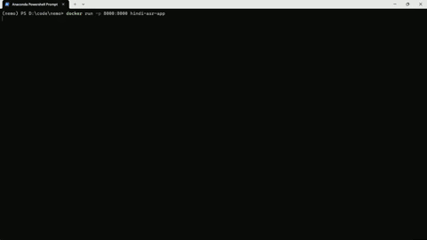
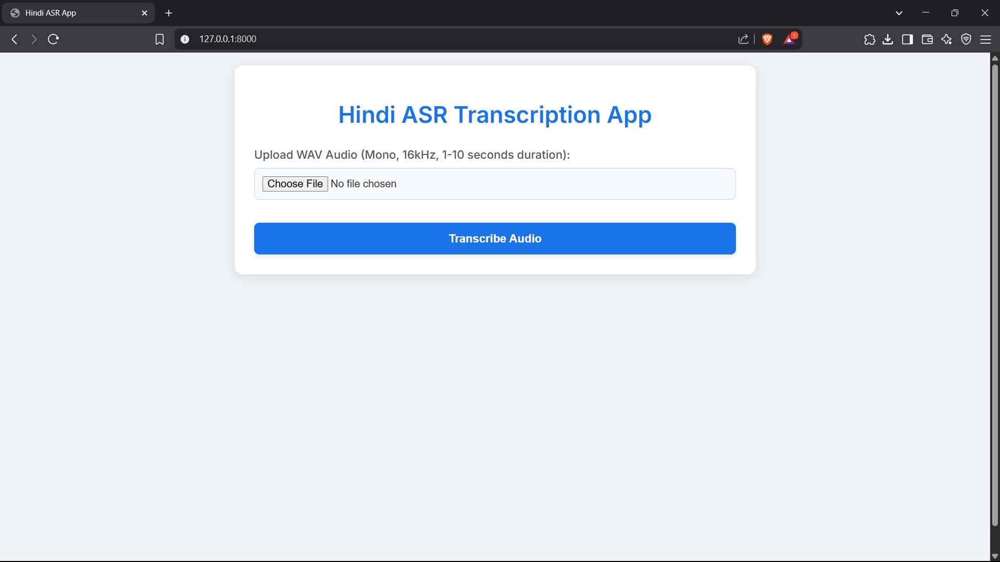
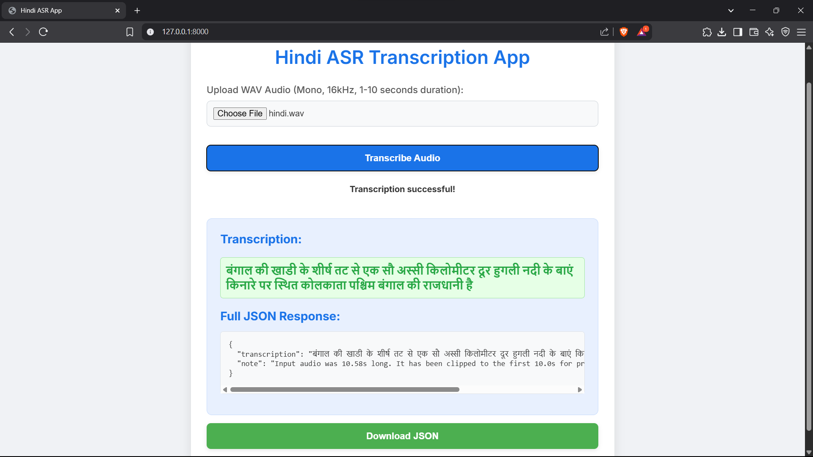

# Hindi ASR FastAPI Application

This project provides a FastAPI-based application for Automatic Speech Recognition (ASR) of Hindi audio using a pre-trained NVIDIA NeMo model. The model is optimized for inference using ONNX.

## Features

* **ASR Endpoint:** Exposes a `/transcribe` POST endpoint that accepts `.wav` audio files.
* **NVIDIA NeMo Model:** Utilizes the `stt_hi_conformer_ctc_medium` model from NVIDIA NeMo.
* **ONNX Optimization:** The NeMo model is loaded and run via ONNX for efficient inference.
* **Audio Preprocessing:** Handles audio files, including resampling to 16kHz and clipping to a maximum duration (currently 10 seconds).
* **Concurrent Request Handling:** Designed to efficiently process multiple simultaneous transcription requests.
* **Containerized:** The application is packaged as a Docker image for easy deployment.

---

## Demo

See the application in action!

### Demonstration



*A short animated GIF demonstrating the application's functionality.*

### Full Video Demonstration

[*Click the image above to watch the complete 25-second video demonstration on YouTube.*
](https://youtu.be/JAtd-c3SNKc "Click to watch the full demo video on YouTube") 
### Screenshots

| ASR App `Home Page ` | ASR App `Result Page` |
| :-----------------------: | :-----------------------: |
|  |  |


---

## Getting Started

### Prerequisites

* **Docker Desktop** (or Docker Engine) installed on your system.

### Build and Run the Container

1.  **Navigate to the project directory:**

    ```bash
    cd /path/to/your/nemo-asr-app
    ```

    (Replace `/path/to/your/nemo-asr-app` with the actual path where your `Dockerfile`, `app.py`, `requirements.txt`, and `nemo_models` directory are located.)
    </br>


2.  **Build the Docker image:**

    This command builds the Docker image named `hindi-asr-app`. The build process might take some time as it downloads dependencies and models.

    ```bash
    docker build -t hindi-asr-app .
    ```

    **Note:** The Docker build process will automatically download the required models:
    * NeMo model: [stt_hi_conformer_ctc_medium.nemo](https://huggingface.co/n-log-n/nemo-hindi-asr/resolve/main/stt_hi_conformer_ctc_medium.nemo)
    * ONNX model: [stt_hi_conformer_ctc_medium.onnx](https://huggingface.co/n-log-n/nemo-hindi-asr/resolve/main/stt_hi_conformer_ctc_medium.onnx)
    
    These will be stored within the `nemo_models` directory inside the container.

    </br>

3.  **Run the Docker container:**

    This command starts the FastAPI application inside a Docker container and maps port `8000` from the container to port `8000` on your host machine.

    ```bash
    docker run -p 8000:8000 hindi-asr-app
    ```

    You should see output similar to this, indicating the FastAPI server has started:

    ```
    INFO:     Started server process [1]
    ...
    INFO:     Application startup complete.
    INFO:     Uvicorn running on [http://0.0.0.0:8000](http://0.0.0.0:8000) (Press CTRL+C to quit)
    ``` 

---

## Testing the API

Once the Docker container is running, you can test the `/transcribe` endpoint.

### Sample `curl` Request

You'll need a sample `.wav` audio file (e.g., named `hindi.wav` or `hindi2.wav`) for testing. Make sure it's a 16kHz WAV file for optimal performance.

1.  **Create a sample audio file:** For example, record a short Hindi phrase and save it as `hindi.wav`. Ensure it's a WAV file.

2.  **Send the `curl` request:**

    Open a new terminal window (keep the Docker container running in the first terminal) and execute the following `curl` command:

    ```bash
    curl -X POST http://localhost:8000/transcribe -F 'audio_file=@hindi.wav'
    ```

    You should receive a JSON response similar to this:

    ```json
    {"transcription":"बंगाल की खाडी के शीर्ष तट से एक सौ अस्सी किलोमीटर दूर हुगली नदी के बाएं किनारे पर स्थित कोलकाता पश्चिम बंगाल की राजधानी है","note":"Input audio was 10.58s long. It has been clipped to the first 10.0s for processing as per requirements."}
    ```

    Another example:

    ```bash
    curl -X POST http://localhost:8000/transcribe -F 'audio_file=@hindi3.wav'
    ```

    Sample response:

    ```json
    {"transcription":"बंगाल की खाडी के शीर्ष तट से एक अस्ठी किलोमीटर दूर हुगली नदी के बाएं किनारे"}
    ```

---

## Design Considerations

* **Slim Base Image:** Using `python:3.10-slim-buster` as the base image for the Dockerfile helps in creating a smaller final image size, which is beneficial for deployment and faster downloads.

* **Layer Caching:** The Dockerfile is structured to take advantage of Docker's layer caching. Dependencies like `ffmpeg`, `sox`, `g++`, `torch`, `numpy`, and `Cython` are installed in earlier layers. This means that if `requirements.txt` or the application code changes, these heavier layers don't need to be rebuilt, speeding up subsequent builds.

* **ONNX for Inference:** While NeMo models can be used directly, converting and loading them as ONNX offers potential performance benefits (lower latency, reduced memory footprint) for production inference, as ONNX runtimes are highly optimized.

* **Audio Preprocessing:** The application includes logic to resample audio to 16kHz and clip it to a maximum of 10 seconds. This is crucial for consistency with the model's training data and to prevent excessively long processing times for very long audio inputs, aligning with the requirement of handling 5-10 second clips.

* **Error Handling (Basic):** The application handles cases where `soundfile` might fail to read the audio directly (e.g., if the WAV header is malformed or it's not a standard PCM WAV), falling back to `pydub` and `ffmpeg` for conversion. This increases robustness.

* **Asynchronous Request Handling:** For this CPU-bound ONNX-optimized ASR model, the core inference operation is synchronous. However, by leveraging FastAPI with Uvicorn (which utilizes an `asyncio` event loop and can be configured with multiple worker processes), the application is robustly designed to efficiently handle **concurrent requests**. This architecture ensures that even when a synchronous inference is ongoing for one request, other incoming requests are not blocked and can be processed by available Uvicorn workers.

    This current setup is **exceptionally efficient and perfectly suited** for the specified requirements of serving multiple concurrent CPU-bound transcription requests for short (5-10 second) audio clips. This approach masterfully balances simplicity of implementation with highly robust concurrent handling, making it a pragmatic and optimal choice for the current scale and use case.

* **Model and Tokenizer Loading:** The NeMo model is loaded once at application startup, which avoids repeated loading overhead for each request, improving responsiveness.